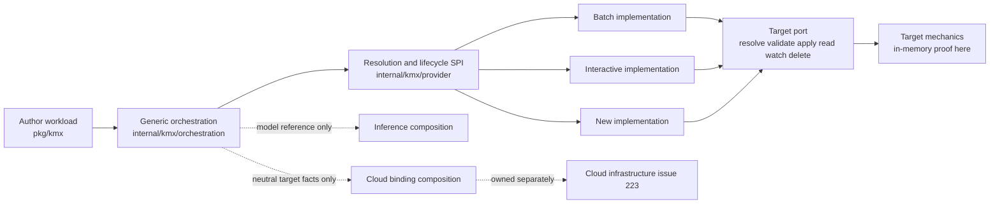

# KMX Separation-of-Concerns Spike

> Researched and drafted with GitHub Copilot on September 25, 2026.

**Status:** Experimental evidence only. These packages are not production-ready
APIs and make no compatibility commitment.

This spike implements the interface-decoupling direction in
[kaimahi-agents/kaimahi#224](https://github.com/kaimahi-agents/kaimahi/issues/224).
It demonstrates that authored workload intent, implementation selection, target
mechanics, inference configuration, and cloud infrastructure can remain separate.

## Goals

- Define portable author-facing workload, lifecycle, stream, evidence, digest,
  idempotency, cancellation, and deletion contracts in `pkg/kmx`.
- Select an internal implementation deterministically from neutral capabilities,
  constraints, contract compatibility, and target class.
- Hide target mechanics behind an internal resolve/validate/apply/read/watch/delete
  port.
- Prove two implementations with different capability sets and prove that another
  implementation can be registered without changing public contracts or generic
  orchestration.
- Enforce the dependency and serialized-surface boundaries with automated tests.

## Non-goals

- Production API stability, migration, compatibility promises, or CLI wiring.
- Adapting the current native implementations in this spike.
- Moving cloud files, changing historical compatibility behavior, or implementing
  account, cluster, identity, monitoring, ownership, recovery, or teardown logic.
  Those remain exclusively in
  [kaimahi-agents/kaimahi#223](https://github.com/kaimahi-agents/kaimahi/issues/223).
- Combining model access with workload placement. Inference remains a sibling
  composition concern represented only by the neutral model reference in the
  authored workload.
- Treating workload deletion as deletion of a cluster, namespace, account, or any
  other shared infrastructure.

## Architecture



The public package contains no target-system clients or objects, cloud SDK/CLI
shapes, process execution, terminal/UI types, implementation identities, or
author-controlled implementation selector. Internal descriptors may retain
implementation identity; stable handles, status, output, errors, and receipts do
not expose it. The binding digest commits to the resolved choice without revealing
that choice.

## Package map

| Package | Responsibility |
|---|---|
| `pkg/kmx` | Portable authored workload and lifecycle contracts |
| `internal/kmx/provider` | Internal descriptor, factory, backend, registry, compatibility, and resolution SPI |
| `internal/kmx/provider/conformancetest` | Shared base lifecycle conformance suite |
| `internal/kmx/target` | Target mechanics port and neutral internal plans/observations |
| `internal/kmx/target/memory` | In-memory target proof and operation journal |
| `internal/kmx/orchestration` | Generic application service using only the public contracts and internal ports |
| `internal/kmx/implementations/batch` | Finite execution proof with output and artifacts |
| `internal/kmx/implementations/interactive` | Long-lived execution proof with logs and cancellation |

## Run the proof

```sh
go test ./pkg/kmx \
  ./internal/kmx/provider \
  ./internal/kmx/target/... \
  ./internal/kmx/implementations/... \
  ./internal/kmx/orchestration

go list -deps ./pkg/kmx
go list -deps ./internal/kmx/orchestration
```

The end-to-end test submits a portable workload, resolves an eligible internal
implementation, exercises the target only through its port, and observes a
neutral handle, status, events, output, artifact, and receipt. Additional tests
cover deterministic selection, duplicate registration, construction failures,
idempotency conflicts, typed unsupported capabilities, substitution, forbidden
public imports/names, serialized surface neutrality, and generic dependency
direction.
